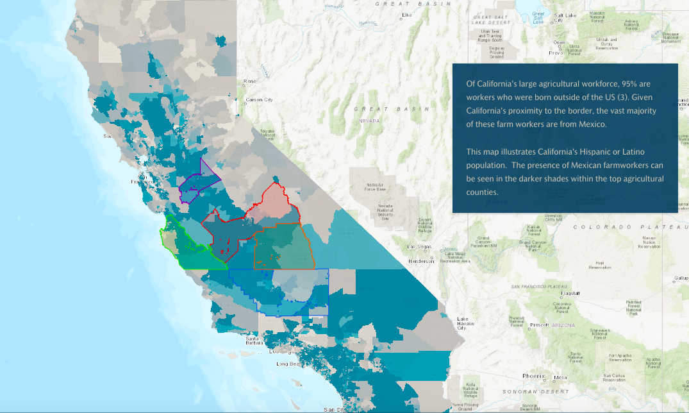
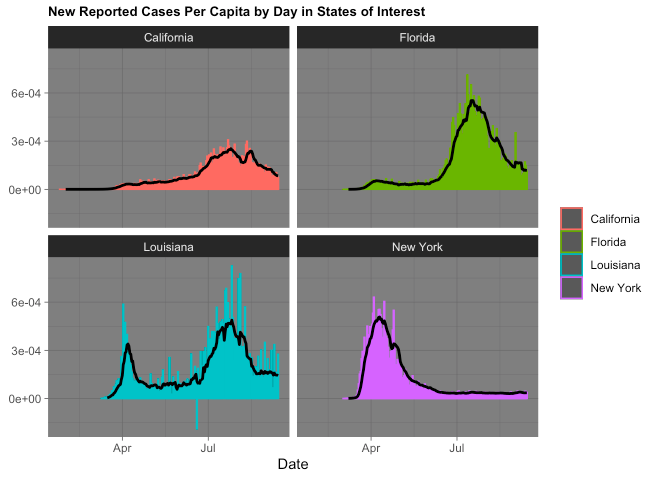
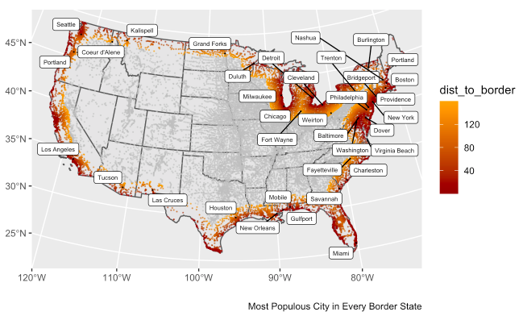
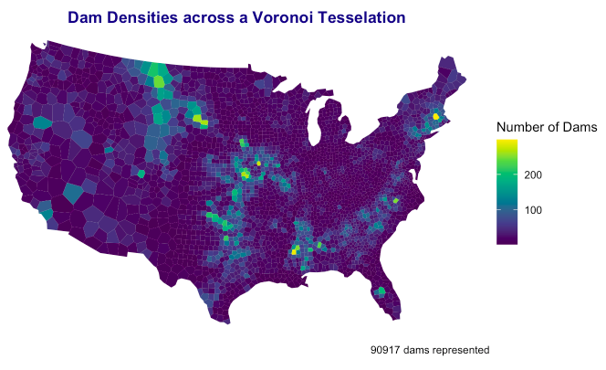
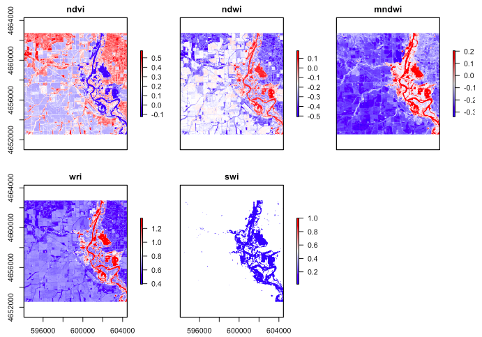
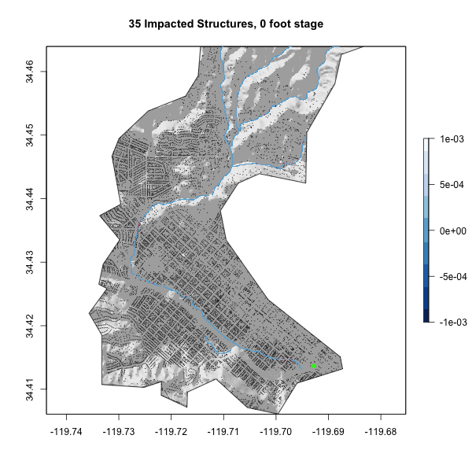
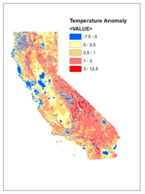
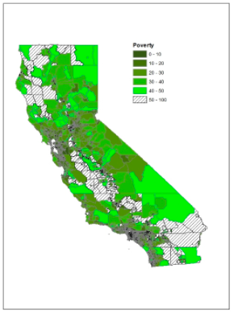

In my time at UCSB I've developed skills in ArcGIS, R, Excel, and STATA. I have experience with data cleaning, collection, analysis, and visualization methods. Here is a collection of links to some of the projects I've created: 

****

### [Building a project website](https://mikaleslie.github.io/index.html)

- Built this static users site with Github Pages 
- Learned what a yml file is, and how to edit one
- Created the basic files required for a website, including an index page and this page, and how to add them to a navbar

****

### [Agriculture and Food Access in California](https://arcg.is/19L5HL0)

- Honors contract for an upper division food systems class investigating trends in food insecurity and population dynamics among California's top agricultural counties
- Collected and cleaned food access and food security data from government websites 
- Used GIS techniques such as spatial overlays to illustrate a trend in the data
- Reproducible code for analysis produced in RStudio and visualizations finalized using ArcGIS Online

{width=70%}

****

### [Data Wrangling: Manipulating Live Covid-19 Pandemic Data](https://mikaleslie.github.io/geog-176A-labs/lab-02.html)

- Worked with live data from the COVID-19 pandemic sourced from the NYT
- Learned how to make tables and graphs with ggplot and knitr
- Worked on data.frame manipulation and joining datasets

{width=60%}

This image was produced using NYT COVID-19 data and shows daily new cases in four states, as well as the seven day rolling mean. 

****

### [Projections, Distances, and Mapping](https://mikaleslie.github.io/geog-176A-labs/lab-03.html)

- Began working with simple features objects and geos measures
- Emphasis was placed on feature aggregations (combines/unions); coordinate references systems; and distance measurements
- Learned how to map geometric features, highlight features of interest using <code>gghhighlight</code> and label points neatly with <code>ggrepel</code>

{width=60%}

This map is a culmination of data analysis throughout the lab, and the application of mapping tools such as <code>gghhighlight</code> and <code>ggrepel</code>.

****

### [Tesselations, Spatial Joins, and Point-in-Polygon: Working with the National Dams Inventory](https://mikaleslie.github.io/geog-176A-labs/lab-04.html)

- Learned about geometry simplication, centroid generation, and tesselations
- Used tesselations to explore the distribution of dams (and dam purpose) across the USA and challenges with the MAUP
- Functions were implemented to automate repetitive tasks

{width=60%}

This image shows density of dam locations in a CONUS projection using a voronoi tesselation. 

****
### [Raster Analysis and Remote Sensing](https://mikaleslie.github.io/geog-176A-labs/lab-05.html)

- In this assignment we worked with multiband raster files to detect and analyze a flood event near Palo, Iowa.
-  Practiced accessing and analysing data from Landsat 8 satellite. 
- Learned about how different wavelengths can highlight different features via different combinations in the RGB channels.
- Practiced raster analysis using raster algebra and thresholding. 

{width=60%}

This image shows five unique thresholding methods for delineating surface water features, created using different combinations of Landsat bands.

****
### [Terrain Analysis: Flood Risk in Mission Creek](https://mikaleslie.github.io/geog-176A-labs/lab-06.html)

- Estimated the number of buildings impacted in the 2017 Santa Barbara flood event along Mission Creek using data from web APIs (NLDI, OSM, AWS Elevation tiles).
- Practiced accessing OSM data using the correct keys and values.
- Used the <code>whitebox</code> frontend to generate a Height Above Nearest Drainage layer for the Mission Creek watershed.
- This flood data was cross analyzed with the OSM data to identify and map impacted buildings.

{width=60%}

This gif shows a flood inundation map library for Mission Creek for stage values ranging from 0 to 20 feet, with the hillshade, flood level, and impacted buildings for each stage.

**** 
### [Identifying Populations Vulnerable to High Heat in California](https://arcg.is/01Kei10)

- Collected and cleaned data from government websites 
- Used GIS techniques such as spatial overlays to analyze data
- Illustrated a correlation between data sets 

{width=30%} {width=30%}

These images show visualizations of some of the data we collected for this project.
