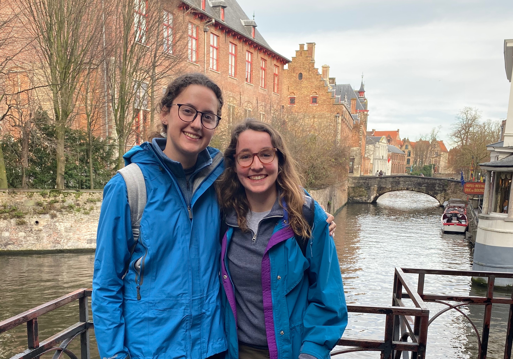

  
I'm a fourth year Environmental Studies student at UCSB, before which I lived in Colorado and Canberra, Australia. Living in places where the natural world has been so readily available has left me with a deep appreciation of our planet, and my hope is that I will be able to continue to protect it and interact with it in my future career. 

I'm studying to receive a Bachelor of Science, and am interested in the applicability of data science in environmental fields. I've held positions in several labs during my time at UCSB, and have gained experience with many techniques including data entry and field work. Through classes at UCSB I've learned how to use ArcGIS, and work with code to accomplish data analysis and GIS work using STATA and R. I created this website in RStudio during one of my classes in the summer of 2020, feel free to check out the rest of the site to see some of the projects I've worked on!

- Contact me: mika.leslie8@gmail.com
- Github: https://github.com/mikaleslie

*****

{width=33%} {width=30%} {width=33%}

****

In my free time, I play ultimate frisbee for UCSB, and our women's team is ranked in the top 10 nationwide. When I'm not palying ultimate, I love hiking and traveling whenever I can. 

