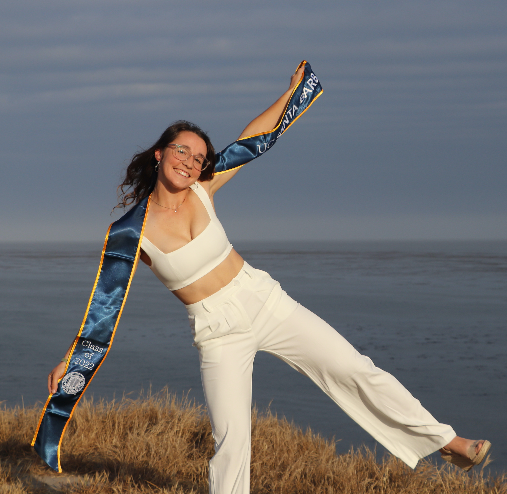

  
I'm a recent graduate from the University of California Santa Barbara, where I received a Bachelor of Science in Environmental Studies. Before this I lived in Colorado and Canberra, Australia. Living in places where the natural world has been so readily available has left me with a deep appreciation of our planet, and my hope is that I will be able to continue to protect it and interact with it in my future career. 

During my time at UCSB I became interested in the applicability of data science in environmental fields. I've held several lab positions and internships at UCSB, and have gained experience with many techniques, including the development of reproducible code for spatial analyses, managing large datasets, and field work. Through classes at UCSB I've learned how to use ArcGIS and work with code to accomplish data analysis and GIS work using STATA and R. I created this website in RStudio during one of my classes in the summer of 2020, feel free to check out the rest of the site to see some of the projects I've worked on!

- Contact me: mika.leslie8@gmail.com
- Github: https://github.com/mikaleslie

*****

{width=33%} {width=30%} {width=33%}

****

In my free time I play ultimate frisbee for UCSB, and our women's team has reached the semi-finals of the National College Championships for the last two years in a row. When I'm not playing ultimate, I love hiking and traveling whenever I can. 

